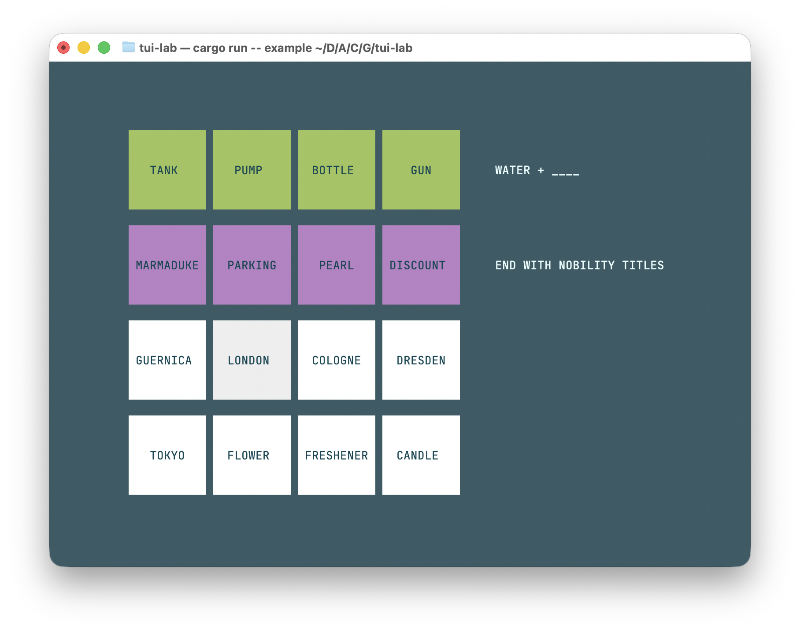

# NYT CLInnections



The daily NYT Connections puzzle, right from your command line!

## How to play

- `cargo run` to play today's puzzle in online mode.
- `cargo run -- <puzzle>.json` to play in offline mode.

Use the arrow keys to navigate, `Space` to select a tile, `Enter` to attempt
a connection, `Q` to quit, and `R` to reset the game.

## Offline mode

Offline mode is a feature that allows loading your own puzzle from a local
JSON file. The format is outlined below. A sample JSON file is also provided
under `examples/`.

```json
{
    "connections": [
        {
            "color": "Color", // Out of "Yellow", "Green", "Blue", "Purple"
            "words": [
                "Word1",
                ...
            ],
            "hint": "Hint"
        },
        ...
    ],
    "seed": 42 // Determines the word ordering
}
```
